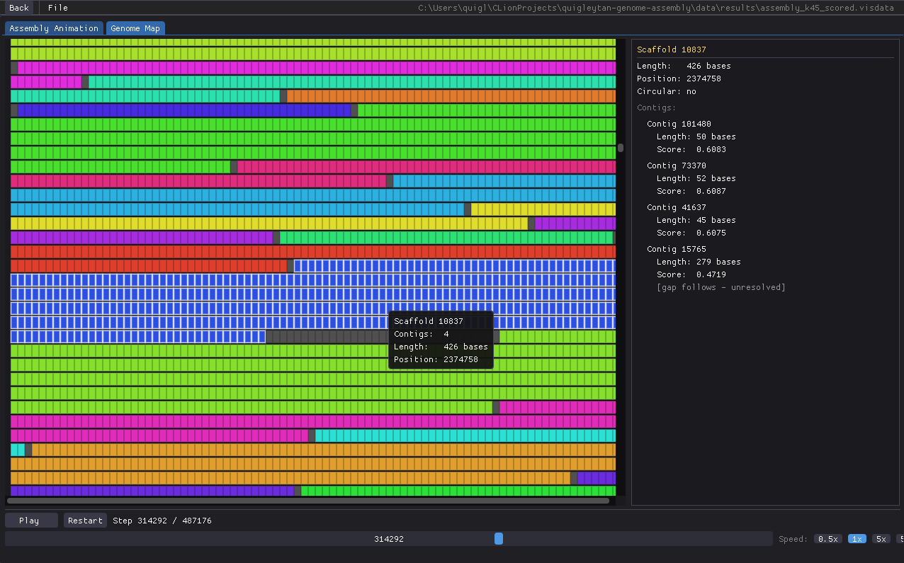
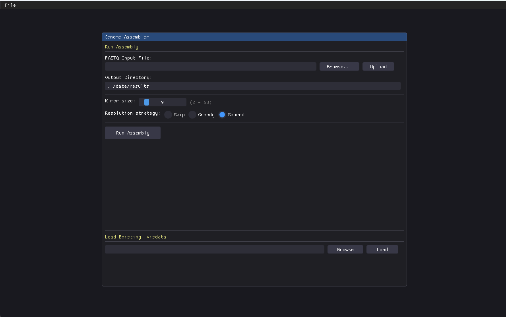
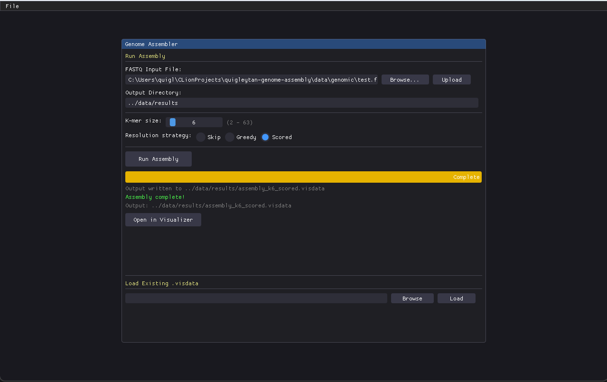
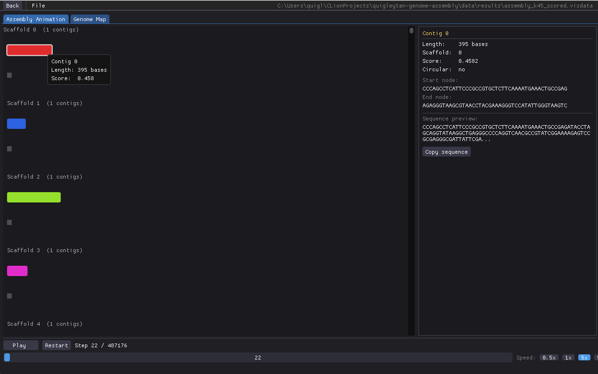
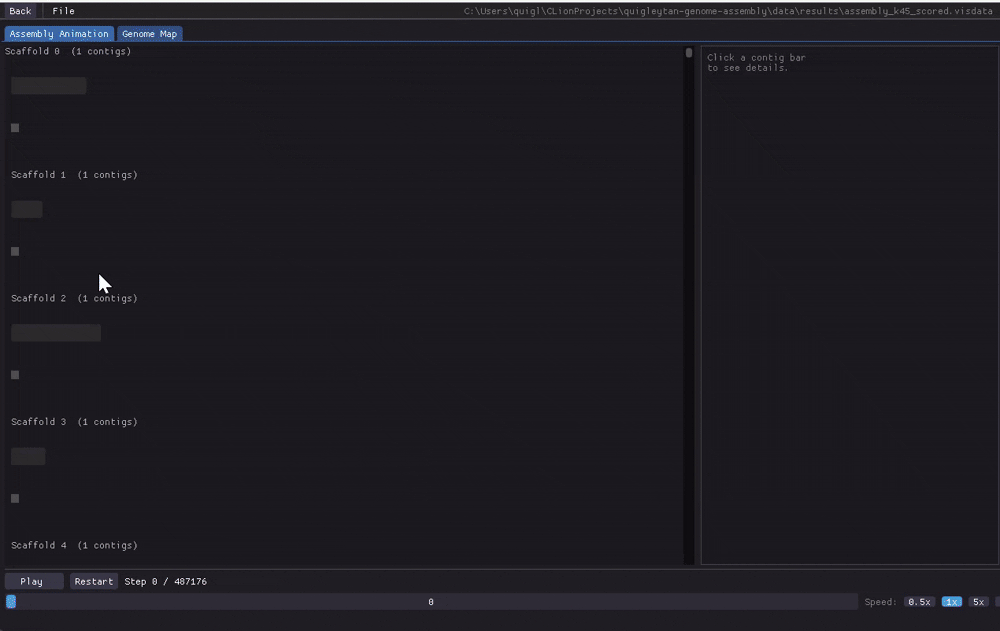

# C++ Genome Assembly & Visualization Toolkit

Built as a deep-dive into the algorithms behind real bioinformatics tools like SPAdes and Velvet, implementing every
component from scratch rather than wrapping existing libraries.

This project consists of a C++17 genome assembly toolkit featuring: 2-bit k-mer encoding, a
De Bruijn graph, multi-phase contig assembly, scaffold resolution, and a
standalone OpenGL/ImGui visualizer for inspecting the assembly process.

No third-party bioinformatics libraries included. The encoding scheme, hash table,
graph, and traversal algorithms are all original implementations, validated
against real genomes (phiX174, lambda phage, *S. cerevisiae* chromosome I,
*E. coli* K-12).



> **Status:** Actively developed. Core pipeline is functional end-to-end,
> including gap estimation and gap filling between scaffolds. See
> [Known Issues & Roadmap](#known-issues--roadmap).

---

## Table of Contents

- [Overview](#overview)
- [Pipeline](#pipeline)
- [Features](#features)
- [Testing Results](#testing-results)
- [Benchmark Results](#benchmark-results)
- [Project Structure](#project-structure)
- [Getting Started](#getting-started)
- [Usage](#usage)
- [Known Issues & Roadmap](#known-issues--roadmap)
- [Development Notes](#development-notes)
- [License](#license)

---

## Overview

This project reconstructs a DNA sequence from short, overlapping reads in FASTQ format.
Eulerian reconstruction served as a proof-of-concept for validating the 2-bit encoding, hash tables, De Bruijn graph, 
and FASTA I/O before tackling the more complex contig-based pipeline.

Given a FASTA/FASTQ input, the pipeline:

1. Encodes every k-mer into a 2-bit-packed `__uint128_t` (supports k up to 63)
2. Builds a De Bruijn graph, where nodes are k-1 mers and edges are k-mers
3. Walks the graph to assemble maximal non-branching paths (contigs)
4. Orders and links contigs into scaffolds using shared boundary k-mers and scoring strategies
5. Resolves unknown gaps between scaffolds: estimates a gap size from
   k-mer frequency drop-off at each boundary, then attempts to bridge it
   with a bounded local search over the existing graph, falling back to an
   N-run sized by the estimate when no path is found
6. Exports the full run (graph stats, contigs, scaffolds, and a step-by-step
   animation trace) to a `.visdata` file
7. Optionally replays that file in a separate GUI to visualize assembly

Two assembly strategies are implemented for comparison:
- **Eulerian path/circuit** (Hierholzer's algorithm) - exact reconstruction,
  but only viable while repeats stay shorter than k
- **Contig-based multi-phase traversal** - the approach that scales to
  real genomes with repeats longer than k

## Pipeline

```
FASTA/FASTQ
     │
     ▼
K-mer Encoding ──────► KmerTable (open addressing, 2-bit packed __uint128_t keys)
     │
     ▼
De Bruijn Graph  (nodes = k-1 mers, edges = k-mers)
     │
     ├──► Eulerian Assembler ──► single reconstructed sequence (small/simple genomes)
     │
     ▼
Contig Assembler  (branch points + sources, then isolated cycles)
     │
     ▼
Scaffolder  (skip / greedy / scored resolution strategies)
     │
     ▼
Gap Estimator + Gap Filler  (k-mer frequency drop → estimate, bounded
     │                        local graph search → bridge or N-pad)
     ├──► FASTA output (scaffolds + full pseudo-genome)
     │
     ▼
.visdata export ──► Visualizer (ImGui + GLFW + OpenGL 3.3)
```

## Features

**Core algorithms**
- 2-bit k-mer encoding/decoding with rolling hash updates, k up to 63 via `__uint128_t`
- Custom open-addressing hash table (linear probing) with virtual hooks for
  specialized subclasses (`KmerTable` counts occurrences, `DeBruijnGraph`
  tracks adjacency/degree)
- Two-phase contig traversal: branch points and source nodes first, then
  isolated cycles unreachable from any external entry point
- Scaffold resolution with three interchangeable strategies:
    - **skip** - never resolve ambiguous branches
    - **greedy** - take the highest length-scoring edge
    - **scored** - weighted combination of contig length, k-mer frequency,
      and overlap quality
- Gap resolution between scaffolds:
    - **Estimation** - compares k-mer frequency in a window at each contig's
      boundary against the genome-wide mean; a larger frequency drop maps to
      a larger estimated gap
    - **Filling** - bounded breadth-first search over the existing De Bruijn
      graph (depth capped by the estimate) attempts to find a real bridging
      path before falling back to an N-run sized by the estimate
- N50 and assembly statistics reporting at every stage

**Visualizer**
- Independent executable that loads, reads, or generates a `.visdata` file - no dependency on
  the assembly pipeline at runtime
- **Integrated assembly UI**: select a FASTQ file, configure k and strategy,
    run the pipeline with live progress tracking, and load results directly
    into the visualizer
- **Assembly Animation** tab: scrubbable, speed-adjustable playback of the
  contig-by-contig traversal, grouped by scaffold
- **Genome Map** tab: full assembled sequence as a wrapped, color-coded
  cell grid with click-to-inspect detail panels for each scaffold/gap
- Built on Dear ImGui + GLFW + OpenGL 3.3, fetched via CMake `FetchContent`
  (no manual dependency setup)

**User Interface**

<table>
<tr>
<td></td>
<td></td>
</tr>
</table>

**Results View**

<table>
<tr>
<td>

</td>
<td>

</td>
</tr>
</table>

## Testing Results

| Genome | Approx. size | Assembly approach | Result |
|---|---|---|---|
| Practice/synthetic sequences | <1 kb | Eulerian + contig | Exact reconstruction |
| Escherichia phage phiX174 | ~5.4 kb | Eulerian | Exact reconstruction |
| Escherichia phage Lambda | ~48.5 kb | Eulerian (near ceiling) | Reconstructed |
| Mycoplasma genitalium G37 | ~580 kb | Contig-based | Scaffolded |
| S. cerevisiae chromosome I | ~230 kb | Contig-based | Scaffolded |
| Escherichia coli K-12 | ~4.6 Mb | Contig-based | Scaffolded |

The practical ceiling for **complete, exact** Eulerian assembly sits
somewhere between ~48 kb and ~230 kb for the genomes tested - past that,
repeats longer than k-1 make a single unambiguous path impossible, which is
exactly why the contig/scaffold pipeline exists.

## Benchmark Results

- Processed 35M base pairs across 350K reads at ~2.05M bp/s on the benchmark.
- From the original implementation, reduced peak memory from 18.8GB to 5.9GB and assembly fragmentation from 16.2M to 1.1M
contigs on a 35M-base benchmark by redesigning the de Bruijn graph's edge representation to eliminate duplicate storage
that scaled with read coverage instead of graph size.

Results (mean ± stddev across 3 runs):

| K  | Parse (ms) | Encode (ms)     | Graph (ms)      | Contigs (ms)     | Scaffold (ms)    | Total (ms)        | RAM (MB) | Contigs | Scaffolds | N50 (bp) |
|----|------------|-----------------|-----------------|------------------|------------------|-------------------|----------|---------|-----------|----------|
| 15 | 0.5 ± 0.1  | 6698.3 ± 1141.1 | 3905.4 ± 1100.5 | 14889.4 ± 4578.8 | 26075.6 ± 2177.3 | 51569.3 ± 8860.3  | 5943.33  | 1737893 | 419294    | 39       |
| 20 | 0.8 ± 0.3  | 5563.4 ± 1691.1 | 2891.9 ± 1069.1 | 15965.4 ± 7649.5 | 10142.0 ± 4147.2 | 34563.5 ± 14289.4 | 5945     | 1241546 | 408544    | 47       |
| 25 | 0.3 ± 0.0  | 3294.5 ± 135.9  | 1851.1 ± 56.0   | 9891.6 ± 392.9   | 6601.6 ± 223.4   | 21639.0 ± 740.9   | 5945     | 1228916 | 407279    | 43       |
| 30 | 0.4 ± 0.1  | 3222.9 ± 100.9  | 1827.5 ± 72.4   | 9599.0 ± 205.7   | 6165.0 ± 149.7   | 20814.9 ± 468.0   | 5945     | 1211748 | 403904    | 43       |
| 35 | 0.3 ± 0.1  | 3100.7 ± 20.3   | 1857.5 ± 42.1   | 9713.6 ± 23.7    | 5948.8 ± 27.8    | 20620.9 ± 67.3    | 5945     | 1193188 | 401796    | 45       |
| 51 | 0.3 ± 0.1  | 2496.3 ± 50.7   | 1662.0 ± 46.6   | 8329.4 ± 165.4   | 4549.0 ± 86.8    | 17037.0 ± 337.3   | 5945     | 1100524 | 389219    | 56       |

Fastest configuration: k=51, total=17037.0 ms, N50=56 bp, RAM=5945.0 MB
Best assembly quality: k=51, N50=56 bp, contigs=1100524

## Project Structure

```
include/assembler/
├── construction/     # K-mer encoding, contig assembly, scaffolding, gap handling
├── core/             # dna_sequence, de_bruijn_graph, kmer_table, recorder, hash table, shared types
├── exceptions/       # Custom exception types
├── io/               # FASTA/FASTQ reader
└── graphics/         # Visualizer: assembly_runner, contig_view, vis_loader/exporter

media/                # Images included in README
src/                  # Mirrors include/ layout, also includes configuration pipelines
tests/                # initialization_tests, processing_tests, construction_tests,
                      # scaffolder_tests, gap_tests
data/
├── genomic/          # Input FASTA/FASTQ test genomes
├── results/          # Output from UI pipeline
```

## Getting Started

**Requirements**
- CMake ≥ 3.14
- A compiler with `__uint128_t` support - **GCC or Clang** (MSVC is not
  supported; this project uses MinGW on Windows)
- Internet access on first build (CMake `FetchContent` pulls GLFW, GLM,
  and Dear ImGui automatically)

```bash
git clone https://github.com/quigleytan/quigleytan_genome_assembler.git
cd quigleytan_genome_assembler
cmake -B build -G "MinGW Makefiles"   # or your preferred generator
cmake --build build
```

This produces several executables (see [Usage](#usage) below) plus the
`user_interface` visualizer.

## Usage

**Run an assembly pipeline**

```bash
./scaffold_assembly        # full pipeline: reads → contigs → scaffolds → FASTA + .visdata
./fasta_eulerian_assembly  # Eulerian path/circuit reconstruction from a FASTA genome
./fasta_contig_assembly    # contig-based assembly from a FASTA genome
./fastq_scaffold_assembly  # contig-based assembly from FASTQ reads
```

Each pipeline prompts interactively for the information it needs - file
path, k-mer size, and (for `scaffold_assembly`) resolution strategy - and
re-prompts on invalid input (unreadable path, non-numeric or out-of-range
k, unrecognized menu choice) instead of failing partway through a run.
`scaffold_assembly` also determines its k-mer table sizing automatically
by scanning the input file, rather than asking for an estimate. Each
pipeline prints graph/contig/scaffold statistics to stdout as it runs and
offers to run again with different settings before exiting.

**Run the visualizer**

```bash
./user_interface
```

## Known Issues & Roadmap

**Open bugs (tracked, not yet fixed)**
- `contig_assembler` doesn't yet initiate walks from sink nodes in every
  case, which is the main source of incomplete traversal on complex graphs

**Planned**
- K-mer frequency filtering (suppress low-count/error k-mers before
  graph construction)
- Gene finding - starting with ORF (open reading frame) detection as
  an approachable entry point, with HMM-based gene prediction as a
  longer-term goal to incorporate ML principles.


## Development Notes

A few decisions and bugs worth calling out, since they shaped a lot of the
design:

- **Why `__uint128_t`:** 64-bit encoding caps k at 32. Splitting the key
  into high/low 64-bit halves for hashing (rather than dropping to a
  smaller type) keeps k up to 63 usable without a second encoding scheme.
- **Reference invalidation after rehash:** the open-addressing table's
  `rehash()` can move every element, which silently broke code that held a
  pointer/reference across an insert. The fix is a consistent two-pass
  pattern - insert all keys first, *then* look each one up - used in both
  adjacency-list initialization and `DeBruijnGraph::addKmer`.
- **Boundary-check ordering in contig walks:** `walkContig` has to check
  whether the *next* node is a boundary (branch point or start-node revisit)
  **before** appending its character - otherwise the boundary base gets
  double-counted between the contig that arrives and the one that departs.
- **k selection matters more than it looks:** k ≥ read length collapses the
  graph to nothing; k too small causes excessive spurious branching from
  short repeated k-mers recurring by chance. There's a real sweet spot per
  dataset, not a single safe default.

## License

MIT: see [LICENSE](LICENSE) for details.

---

**Author:** Tanner Quigley
